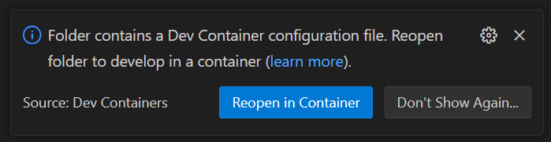
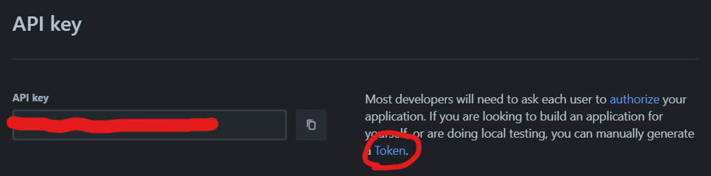

# DevOps Apprenticeship: Project Exercise

> If you are using GitPod for the project exercise (i.e. you cannot use your local machine) then you'll want to launch a VM using the [following link](https://gitpod.io/#https://github.com/CorndelWithSoftwire/DevOps-Course-Starter). Note this VM comes pre-setup with Python & Poetry pre-installed.

## System Requirements

The project uses poetry for Python to create an isolated environment and manage package dependencies. You can either use the provided devcontainer which has poetry and python pre-installed or manually install it. Follow the appropriate instructions below.

### Dev Container (preferred)
Open the folder in VS Code. If working on a Windows machine it is advisable to clone the repo in Windows Subsystem for Linux 2 (WSL2) and open VS Code there, as it dramatically improves the performance of file-system operations. See instructions for installing WSL [here](https://learn.microsoft.com/en-us/windows/wsl/install).

When you open the folder in VSCode you should be prompted to open in a Dev Container. Click "Reopen in Container". The container will take a few minutes to build.



You can check poetry is installed by running `poetry --version` from a terminal.

### Manual Installation
To prepare your system, ensure you have an official distribution of Python version 3.8+ and install Poetry using one of the following commands (as instructed by the [poetry documentation](https://python-poetry.org/docs/#system-requirements)):

#### Poetry installation (Bash)

```bash
curl -sSL https://install.python-poetry.org | python3 -
```

#### Poetry installation (PowerShell)

```powershell
(Invoke-WebRequest -Uri https://install.python-poetry.org -UseBasicParsing).Content | py -
```

You can check poetry is installed by running `poetry --version` from a terminal.

**Please note that after installing poetry you may need to restart VSCode and any terminals you are running before poetry will be recognised.**

## Dependencies

The project uses a virtual environment to isolate package dependencies. If using a Dev Container this should have happened on startup. To manually create the virtual environment and install required packages, run the following from your preferred shell:

```bash
$ poetry install
```

You'll also need to clone a new `.env` file from the `.env.template` to store local configuration options. This is a one-time operation on first setup:

```bash
$ cp .env.template .env  # (first time only)
```

The `.env` file is used by flask to set environment variables when running `flask run`. This enables things like development mode (which also enables features like hot reloading when you make a file change). There's also a [SECRET_KEY](https://flask.palletsprojects.com/en/2.3.x/config/#SECRET_KEY) variable which is used to encrypt the flask session cookie.

### Populating TRELLO_ Environment Variables

This project uses the Trello API to manage TODO items. In order to 

1. [Create a Trello account](https://trello.com/signup) if you don't already have one
1. [Create an API Key for Trello](https://developer.atlassian.com/cloud/trello/guides/rest-api/api-introduction/#managing-your-api-key)
    - To do this you’ll first need to create a Trello Power Up (from [this page](https://trello.com/power-ups/admin))
    - After creating a Trello Power Up you’ll be given the option to generate a new API key
    - Copy the value of '`API Key`' into `TRELLO_API_KEY` in [.env](.env)
1. Create a API Token for Trello.
    - This can be done by clicking the “Token” link on the same page where your API key is displayed: Trello API Credentials
    - Copy the generated token into `TRELLO_API_TOKEN` in [.env](.env)

1. Create a new board (possibly in a new workspace if you already have other ones)
    - Find the ID of the board
    - Use [Thunder Client Extension](https://marketplace.visualstudio.com/items?itemName=rangav.vscode-thunder-client)
        1. Import [the local environment](./docs/thunder-client/dev-env.json)
        1. Find your account id using `https://api.trello.com/1/members/me?key={{TRELLO_API_KEY}}&token={{TRELLO_API_TOKEN}}&fields=id`
        1. Find your board using `https://api.trello.com/1/members/{id}/boards?key={{TRELLO_API_KEY}}&token={{TRELLO_API_TOKEN}}&fields=id,name` 
        1. Copy the board's id into `TRELLO_BOARD_ID` in [.env](.env)
        1. Find the relevant column in the board using `https://api.trello.com/1/boards/{id}/lists?key={{TRELLO_API_KEY}}&token={{TRELLO_API_TOKEN}}&fields=id,name`
        1. Copy the list's for the To Do and Done columns into `TRELLO_TODO_LIST_ID` and `TRELLO_DONE_LIST_ID`, respectively in [.env](.env)

## Running the App

Once the all dependencies have been installed, start the Flask app in development mode within the Poetry environment by running:
```bash
$ poetry run flask run
```

You should see output similar to the following:
```bash
 * Serving Flask app 'todo_app/app'
 * Debug mode: on
WARNING: This is a development server. Do not use it in a production deployment. Use a production WSGI server instead.
 * Running on http://127.0.0.1:5000
Press CTRL+C to quit
 * Restarting with stat
 * Debugger is active!
 * Debugger PIN: 113-666-066
```
Now visit [`http://localhost:5000/`](http://localhost:5000/) in your web browser to view the app.
